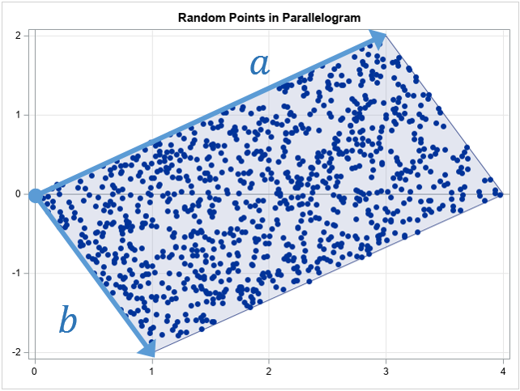

### 在多边形内生成随机点

在多边形内生成随机点有两种方法，简略介绍如下：

- 在多边形外接矩形内生成随机点，接着判断该点是否落入多边形内，如果落入则接受该点。
- 对多边形进行三角剖分得到众多三角形，随机选择一个三角形在其内部随机生成一个点。

前者思路简单，借助现有计算几何工具，如GEOS等可以轻松实现，但是效率不高，体现在两个方面：一、判断点是否落入多边形这个空间关系判断上。二、为了得到一个在多边形内部的点可能需要进行多次 随机生成点/空间关系判断 运算，这也与多边形面积与其外接矩形面积比例有关，该比例越小，即需要进行重复的次数就可能越多。以上带来的时间复杂度上的不稳定。

后者生成效率高，但实现复杂，涉及一下三个关键点：

1. 对多边形进行三角剖分(triangulation)

   三角剖分事宜借助mapbox的[earcut.hpp]([earcut.hpp](https://github.com/mapbox/earcut.hpp))实现，此处不再赘述。

2. 随机选择其中一个三角形

   三角剖分的结果是得到三角形数组（假设得到N个三角形），我们需要随机从该数组中选择一个三角形后续使用。我们不能简单生成从[0, N]中随机选择一个索引来选择三角形，这样子会导致每个三角形被选择的概率一致，导致最终生成的点在多边形内分布不均匀。正确的做法时按照面积权重随机选择三角形：面积越大的三角形被选择的机率越大，面积越小的三角形被选择的机率越小。具体做法如下：

   一、生成三角形数组面积累加数组

   ​        设有三角形数组：[T1, T2, ..., TN]，Ti表示第i个三角形，则面积累加数组为[A1, A1 + A2, ..., A(N-1) + AN]，则面积累加数组最后一个元素值为多边形面积，即为Amax

   二、取值为[0, 1)的随机数乘以Amax得到一面积A，在面积累加数组中从索引小到大选择第一个面积大于该值的累积值，该累积值对应索引的三角形即为我们要随机选择的三角形。Note：这一步可使用二分查找法加速搜索性能。

3. 在三角形内部随机生成点

   首先我们看下在平行四边形内部生成随机点：

   

​                                      p = u * vec_a + v * vec_b, 0 <=u & v < 1

如果u + v <= 1，则点p将会落入以a b向量为边的三角形内。如果 (u + v) > 1 则 (1 - u) + (1 - v ) <= 1，即可得到一下在三角形内随机生成多边形的代码，参考QGIS实现：

```cpp
void QgsGeometryUtils::weightedPointInTriangle( const double aX, const double aY, const double bX, const double bY, const double cX, const double cY,
    double weightB, double weightC, double &pointX, double &pointY )
{
  // if point will be outside of the triangle, invert weights
  if ( weightB + weightC > 1 )
  {
    weightB = 1 - weightB;
    weightC = 1 - weightC;
  }

  const double rBx = weightB * ( bX - aX );
  const double rBy = weightB * ( bY - aY );
  const double rCx = weightC * ( cX - aX );
  const double rCy = weightC * ( cY - aY );

  pointX = rBx + rCx + aX;
  pointY = rBy + rCy + aY;
}
```

